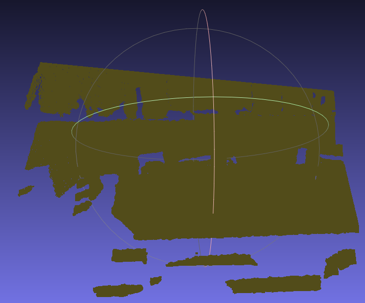
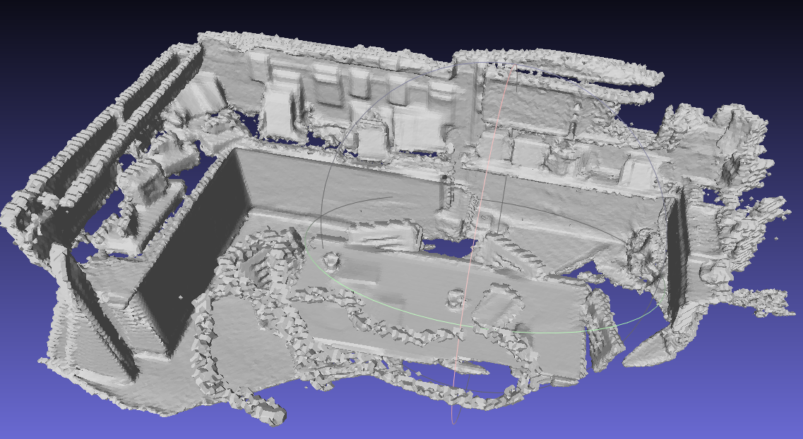
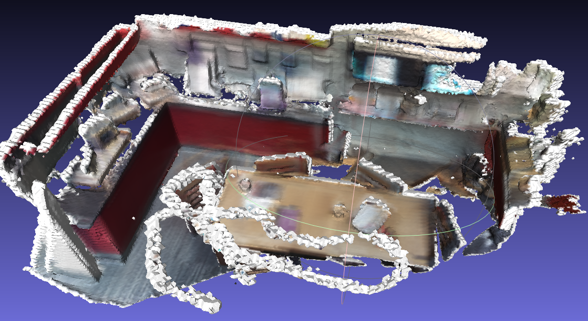

# 第一次作业

### Task1
使用`np.meshgrid()`函数获得深度图的像素坐标，运用所给的公式转换为世界坐标。

直接调用`trimesh.PointCloud(vertices=world_pts)`即可对点云进行可视化。最后一帧的点云在meshlab下可视化如下（原始Mesh见`pointcloud.ply`文件

vol_bounds的结果见vol_bounds.txt文件。

使用`np.meshgrid()`函数确定每个体素小立方体的坐标。将TSDF场的所有初始TSDF值设置为`truncate_margin`，`weight`设置为0。

### Task2

预先根据vol_bnds计算出每个TSDF场中整数格点的世界坐标。使用公式 
$$X_{camera}=PoseMatrix^{-1}*X_{world}$$
从世界坐标系转换到相机坐标系，使用公式 
$$(u,v,1)^T=K*X_{camera}$$
转换到像素坐标。

### Task3
对于落在图片范围内的每个像素。

使用公式

$$
TSDF = \max\{\min \{1.0, (depth - z) / t \}, -1.0\}
$$

单帧的TSDF值

### Task4
将TSDF的值超出`trunc_margin`部分的采用点的weight设置为0。并使用所给公式融合得到整体的TSDF场。

Marching Cubes算法调用`measure.marching_cubes`函数。并在完成调用之后加上TSDF场的偏移量，导出最终Mesh。最终重建结果如下。

### Task5
使用RGB图片数据，实现带颜色的TSDF Fusion的过程。

颜色的更新过程与TSDF场的更新公式完全相同，可以很容易地得到TSDF场每个采样点的颜色。

在Marching Cubes算法完成后，查询每个顶点最近的TSDF场的采用点，将颜色设置为该采用点的颜色，即得到带颜色的TSDF Fusion，结果如下。（注意这里将TSDF的采用点初始颜色设置为了白色，因此生成的Mesh颜色偏白）

更多Fusion的中间结果见`result`目录
