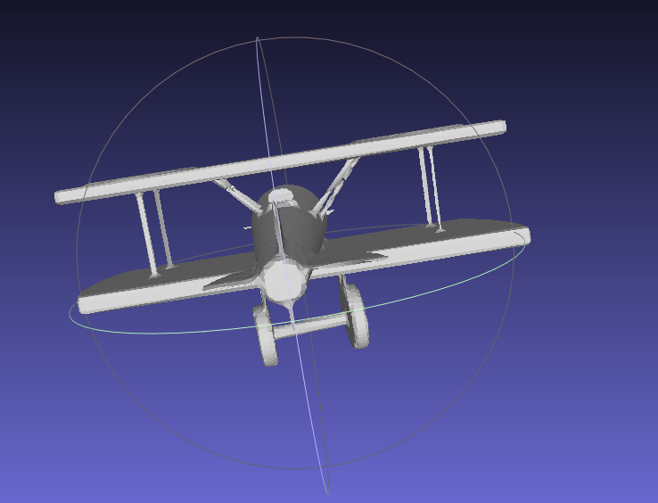
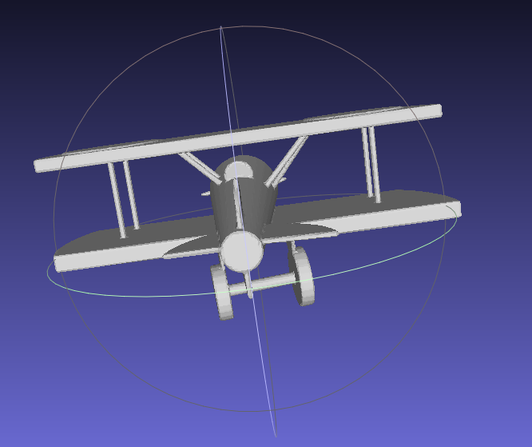
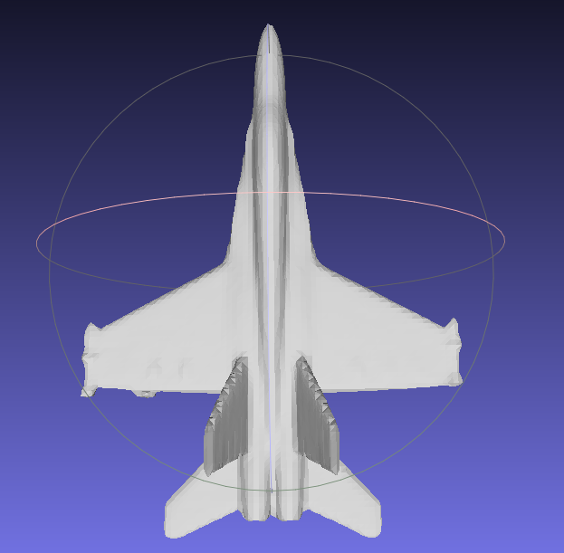
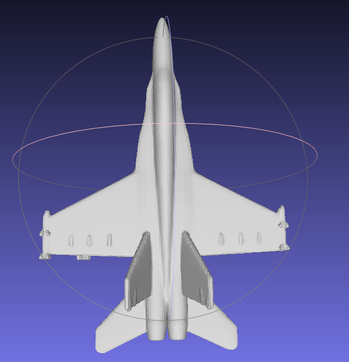
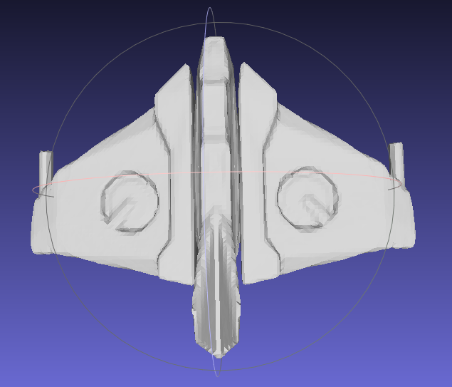
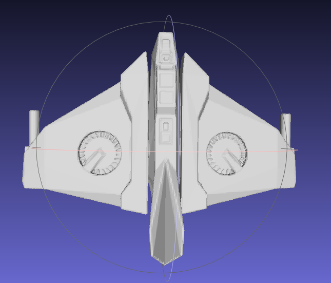
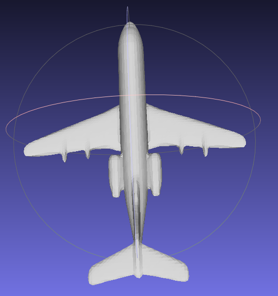
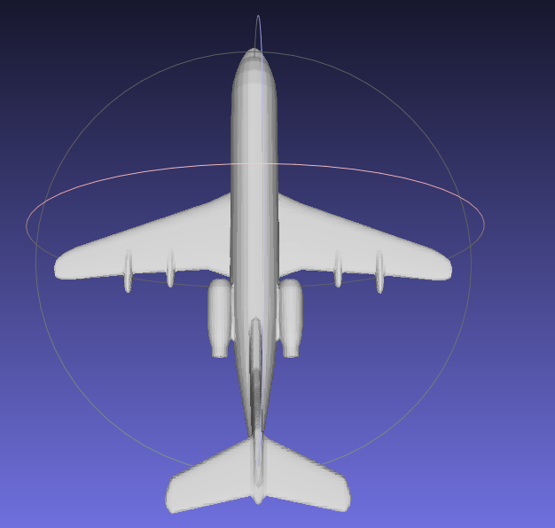
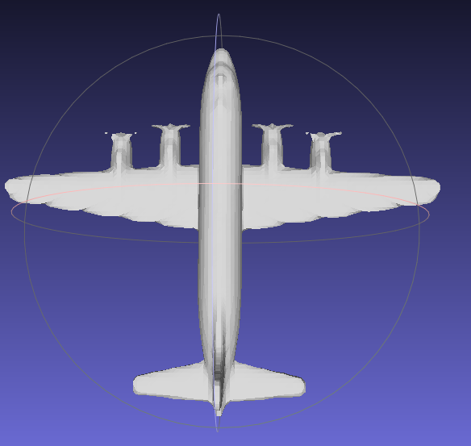
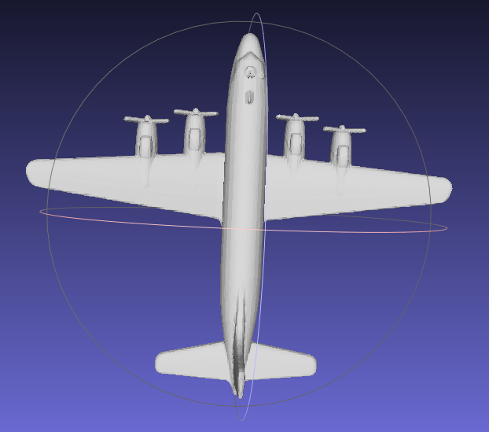

# 第四次作业报告

### 实现思路
使用8层MLP预测采用点的SDF值，输入是3维采用点坐标，输出1维SDF值。损失函数使用MSE loss。

### 实现效果
实现效果详情见output_1至output_5文件。总体几何形状拟合得很好，但部分细节纹理缺失。

#### 例子一：

**prediction:**

**ground truth:**

#### 例子二：

**prediction:**

**ground truth:**

#### 例子三：

**prediction:**

**ground truth:**

#### 例子四：

**prediction:**

**ground truth:**

#### 例子五：

**prediction:**

**ground truth:**
